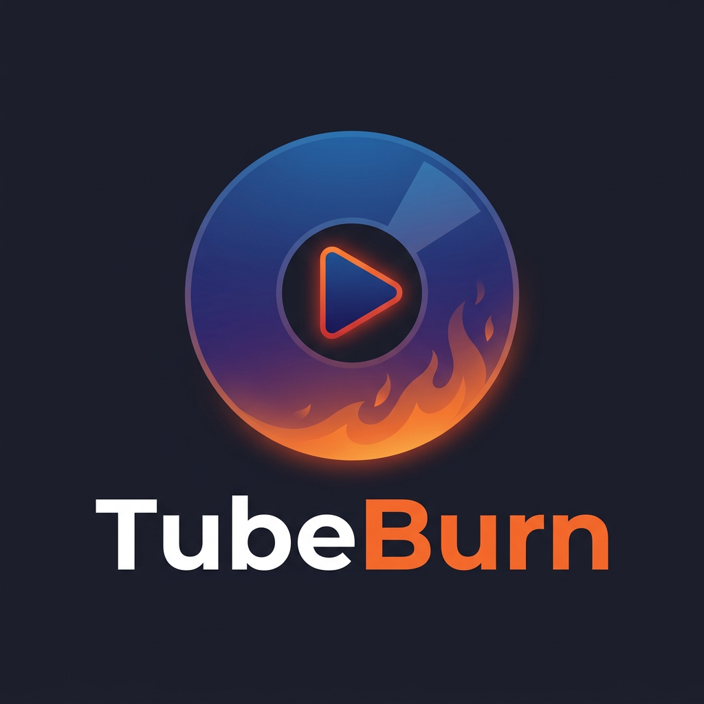

<p align="center">
  
</p>

<p align="center">
  A cross-platform desktop application that downloads YouTube videos, authors a DVD-Video disc with interactive menus, and burns it to DVD-R.<br>
  Built with .NET 10, C#, and Avalonia UI.
</p>

<p align="center">
  <a href="https://ko-fi.com/headsensenet"></a>
  <a href="LICENSE"></a>
</p>

## Features

- **YouTube integration** — Paste URLs or playlist links; TubeBurn downloads videos, thumbnails, and channel artwork via yt-dlp
- **Native DVD authoring** — Generates compliant DVD-Video structure (IFO, VOB, menus) entirely in C#, no runtime dependency on dvdauthor
- **Interactive menus** — Two-level menu system: Channel Select → Video Select, with pagination, button highlights, and subpicture overlays
- **Hardware-compatible output** — Produces DVD-Video discs playable on standalone DVD players, not just software players
- **SkiaSharp menu rendering** — Channel avatars, video thumbnails, banner backgrounds, configurable fonts
- **Smart transcoding** — Hardware-accelerated MPEG-2 encoding via ffmpeg with configurable bitrate (2–6 Mbps), parallel workers, and cache-aware re-transcoding
- **Disc capacity validation** — Pre-build estimates and post-transcode hard gates for DVD-5 (4.37 GB) and DVD-9 (7.95 GB)
- **Cross-platform burning** — IMAPI2 on Windows, growisofs on Linux, with ImgBurn as an opt-in fallback
- **Build-only mode** — Author a VIDEO_TS folder and ISO without burning, then test with VLC

## Requirements

- [.NET 10 SDK](https://dotnet.microsoft.com/download)
- [ffmpeg](https://ffmpeg.org/) — video transcoding and menu background encoding
- [yt-dlp](https://github.com/yt-dlp/yt-dlp) — YouTube downloading

Optional:
- [VLC](https://www.videolan.org/) — test playback via `dvd:///` protocol
- [dvdauthor](http://dvdauthor.sourceforge.net/) — external authoring fallback for A/B validation
- [ImgBurn](https://www.imgburn.com/) — Windows burn fallback (opt-in via `TB_ENABLE_IMGBURN_FALLBACK=1`)

## Getting Started

```bash
# Build
dotnet build

# Run the app
dotnet run --project src/TubeBurn.App

# Run tests
dotnet test tests/TubeBurn.Tests
```

TubeBurn discovers ffmpeg and yt-dlp from your system PATH automatically. You can also configure tool paths manually in the app's Tool Paths panel.

## How It Works

1. **Add videos** — Paste YouTube URLs into the queue. TubeBurn fetches metadata (title, duration, channel, thumbnails) in the background.
2. **Configure** — Choose NTSC/PAL, disc type, video bitrate, and output folder.
3. **Build** — TubeBurn downloads videos, transcodes to DVD-compliant MPEG-2, generates interactive menus with channel/video artwork, authors the full VIDEO_TS structure, and creates an ISO.
4. **Burn** — Write to DVD-R, or use build-only mode and test with VLC.

## Project Structure

```
src/
  TubeBurn.App/            Avalonia UI desktop application
  TubeBurn.Domain/         Domain models (no external dependencies)
  TubeBurn.DvdAuthoring/   Native DVD authoring engine (no external dependencies)
  TubeBurn.Infrastructure/  External tool wrappers (ffmpeg, yt-dlp, SkiaSharp, IMAPI2)
tests/
  TubeBurn.Tests/          xUnit integration and unit tests
  TubeBurn.DesktopUiTests/ FlaUI desktop automation (Windows, opt-in)
reference/
  dvdauthor/               Original dvdauthor C source (porting reference)
```

The Domain and DvdAuthoring projects have zero external NuGet dependencies by design — all external tool interaction lives in Infrastructure.

## DVD Menu System

TubeBurn generates a two-level interactive menu:

- **Level 1 — Channel Select** (VMGM): One row per YouTube channel with circle avatar and channel name. Skipped automatically for single-channel projects.
- **Level 2 — Video Select** (VTSM): One row per video with thumbnail and title. Paginated with Next/Prev navigation. Back button returns to Channel Select.

Menus use DVD subpicture overlays for button highlights with full remote control navigation (up/down/enter/back).

## Testing

```bash
# All tests
dotnet test tests/TubeBurn.Tests

# Specific categories
dotnet test tests/TubeBurn.Tests --filter "FullyQualifiedName~DvdMenuSystem"
dotnet test tests/TubeBurn.Tests --filter "FullyQualifiedName~MenuBinary"

# VLC screenshot validation (requires tests/lib/vlc/)
dotnet test tests/TubeBurn.Tests --filter "FullyQualifiedName~VlcDvdnav_multi_channel_shows"
```

## Support

TubeBurn was originally built for prison ministry — making it easy to put YouTube content onto DVDs for people without internet access. If you find it useful, consider supporting development:

[](https://ko-fi.com/headsensenet)

## License

[MIT](LICENSE) — free to use, modify, and distribute with attribution.
